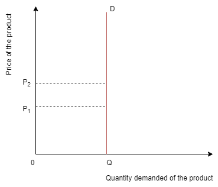
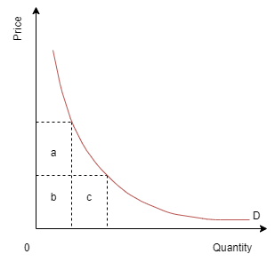

# Price elasticity of demand

## For starters
Demand is the quantity of a good or service that consumers are **willing and able to purchase** at different prices in a given time period.

Law of demand states that *as the price of a good falls, the quantity demanded for that good increases ceteris paribus*.

Elasticity is a measure of responsiveness. We will look at two types of elasticities of demand, price elasticity of demand(PED) and income elasticity of demand(YED).

## Price elasticity of demand(PED)
**Price elasticity of demand** is a measure of how much the demand for a product changes when there is a change in one of the factors that determine demand.

There are two extreme and only theoretical PED values:

- If PED=0 then a change in the price of a product will have no effect on the quantity demanded. The demand is then *perfectly inelastic*.

- If PED=∞ then the quantity demanded changes infinitely in response to a change in price. This is known as *perfectly elastic* demand.

Demand can more typically fall into three categories:
- Inelastic demand- **0<PED<1**. This means that a change in price leads to a proportionately smaller change in demand. Price increases will lead to higher revenues even if demand falls slightly.
- Elastic demand- **1<PED<∞**. In this case a change in price will lead to a greater than proportionate change in demand hence a price increase will lead to a loss in sales revenue.
- Unit elastic demand- **PED=1**. In case of unit elastic demand a change in price will lead to a proportionate, opposite change in the quantity demanded.

It is important to remember that PED is not equal across the curve as the curve is not straight.

## Determinants of price elasticity of demand
1. **Number and closeness of substitutes.**
2. **The necessity of the product and how widely the product is defined.**
3. **The proportion of income spent on the good.**
4. **The time period considered.**

## Why is knowledge of PED important
Understanding of PED is useful for governments and firms. Firms use it to predict the effects of their pricing decisions on the total revenue. Governments on the other hand use it to predict the consequences of imposition of indirect taxes.

## Income elasticity of demand(YED)
**Income elasticity of demand** is a measure of how much the demand for a product changes when there is a change in the consumer’s income.

YED values:
- For inferior goods the YED<0. A given increase in income will lead to a proportionately smaller fall in demand.
- For necessity goods 0<YED<1. A given increase in income will lead to a proportionately smaller increase in demand.
- For luxury goods YED>1. This means that a given increase in income will lead to a proportionately larger increase in demand.

## HL Why is knowledge of YED important
- For firms: Understanding income elasticity of demand (YED) is essential for firms because it shows how changes in consumer income impact the demand for their products. By knowing YED, firms can tailor their strategies to changing consumer income levels, optimising production, pricing, and marketing decisions accordingly.
- To explain sectoral changes in the structure of the economy: There are three sectors in the economy - Primary sector, Secondary (manufacturing) sector and Tertiary(service)sector. Sectoral changes refer to a shift in relative share of national output and employment that is attributed to each sector as the economy develops. Understanding the relationship between sectoral changes and YED helps policymakers and businesses anticipate shifts in demand patterns, allocate resources efficiently, and foster sustainable economic development.

## Exercises
1. To what extent does the elasticity of demand affect pricing strategies and revenue management for firms? Analyse how firms can use knowledge of demand elasticity to maximise their revenue and market share.
2. Evaluate the importance of price elasticity of demand for businesses in making pricing decisions. To what extent does understanding elasticity help firms maximise revenue and achieve their profit objectives?
3. Discuss the price elasticity of demand (PED) for primary commodities such as agricultural products or raw materials.
4. Discuss the concept of elastic and inelastic demand and their implications for government policies, such as taxation and subsidy programs. How does the responsiveness of demand to price changes affect the effectiveness of such policies in achieving their intended objectives?

